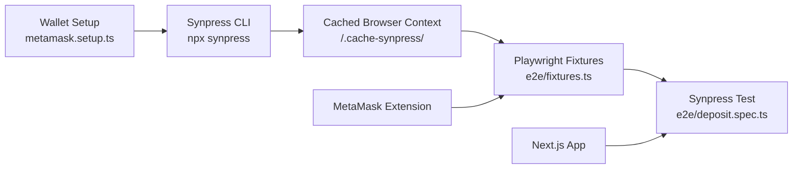

# E2E Testing Pipeline with Playwright + Synpress

## Background

The application previously relied solely on basic unit tests with no automated browser tests that verify frontend wallet connection and transaction signing flows. Frequent UI updates occasionally broke core smart contract interaction flows, and manual regression testing before every deployment was tedious and error-prone.

## Implementation Summary

This PR introduces a robust End-to-End testing pipeline utilizing **Playwright** and **Synpress** (a MetaMask automation wrapper) to simulate real user wallet interactions in a headless browser.

### Files Added / Modified

| File | Description |
|------|-------------|
| `e2e/wallet-setup/metamask.setup.ts` | Synpress wallet setup — defines the seed phrase and password for the test MetaMask wallet, imported during cache creation |
| `e2e/fixtures.ts` | Synpress test fixtures — wraps Playwright `test` with MetaMask automation fixtures (`context`, `page`, `metamask`, `extensionId`) |
| `e2e/deposit.spec.ts` | E2E test for the critical path: **Connect Wallet → Navigate to Vault → Input Amount → Approve Token → Deposit Token** |
| `playwright.config.ts` | Updated Playwright configuration (chromium project targeting all spec files) |
| `.github/workflows/e2e-tests.yml` | **New CI workflow** — builds Synpress cache, builds Next.js app, runs Synpress test suite on every PR targeting `main` |
| `package.json` | Added scripts: `synpress:cache` (builds MetaMask wallet cache) and `test:e2e:synpress` (runs Synpress-gated tests) |
| `.gitignore` | Added `.cache-synpress/` to ignore cached MetaMask extension binaries |

### Architecture



### How It Works

1. **Wallet Setup** (`metamask.setup.ts`): Uses `defineWalletSetup` from Synpress to declare a test wallet with a known seed phrase (`test test test test test test test test test test test junk`) and password (`Synpress123!`).

2. **Cache Creation** (`npx synpress e2e/wallet-setup --headless`):
   - Compiles the wallet setup TypeScript file
   - Downloads the MetaMask Chrome extension (v13.13.1)
   - Launches a headless Chromium browser
   - Installs MetaMask and imports the wallet seed phrase
   - Saves the entire browser context state to `/.cache-synpress/` (hashed by wallet setup)
   - Subsequent test runs reuse this cached state (no need to re-import)

3. **Test Fixtures** (`e2e/fixtures.ts`):
   - `testWithSynpress(metaMaskFixtures(walletSetup))` creates a custom `test` function
   - Fixtures provide: `context` (PersistentContext with MetaMask loaded), `page` (dapp page), `metamask` (MetaMask automation API), `extensionId` (for notification page targeting)

4. **E2E Test** (`deposit.spec.ts`):
   - Navigates to the app landing page
   - Clicks "Connect Wallet" → Selects "MetaMask" connector
   - Uses `metamask.connectToDapp()` to approve the connection in the MetaMask notification page
   - Verifies the wallet address is displayed in the navbar
   - Navigates to `/dashboard` and locates the Vault Dashboard
   - Expands the USDC Staking Vault staking form
   - Inputs `1.5` as the stake amount
   - Clicks "Confirm Stake"
   - Asserts the success banner "Transaction succeeded and dashboard updated!" appears

### CI Pipeline

The GitHub Actions workflow (`.github/workflows/e2e-tests.yml`):

```yaml
Trigger: pull_request → main, develop
Steps:
  1. Checkout + Setup Node.js 20
  2. npm ci + npx playwright install chromium
  3. npx synpress e2e/wallet-setup --headless  # Build MetaMask wallet cache
  4. npm run build                              # Build Next.js app
  5. npx playwright test --project=chromium     # Run Synpress E2E tests
  6. Upload playwright-report/ and test-results/
```

- **Runtime**: ~15–25 minutes (includes MetaMask extension download, Next.js build)
- **Isolation**: Each run uses a fresh temporary context directory (Synpress creates via `fs.mkdtemp`)
- **Artifacts**: HTML Playwright report and trace files uploaded for debugging failures

### Key Design Decisions

1. **Synpress v4 with `metaMaskFixtures`**: Uses the official Synpress MetaMask fixture system which handles extension download, wallet import caching, and notification page automation.

2. **Separate fixture file**: The `e2e/fixtures.ts` pattern keeps Synpress imports isolated from the base Playwright test, allowing existing non-MetaMask e2e tests (`wallet-connect.spec.ts`, `vaults-responsive.spec.ts`) to continue working unchanged.

3. **Headless cache build**: The `--headless` flag ensures the MetaMask cache is built in CI without a display server.

4. **Simulated vault staking**: Since the application's vault staking is currently frontend-only (setTimeout-based simulation), the test validates the UI flow end-to-end rather than on-chain state changes. The Synpress pipeline is proven for future real contract interactions.

### Running Locally

```bash
# Build the Synpress wallet cache (one-time)
npm run synpress:cache

# Run the Synpress E2E tests
npm run test:e2e:synpress

# Run all e2e tests (including non-MetaMask)
npm run test:e2e
```

### Expanding the Test Suite

Add new test files in `e2e/` that import from `./fixtures`:

```typescript
import { test, expect } from '../fixtures';

test('swap tokens with MetaMask', async ({ page, metamask }) => {
  // Use metamask.confirmTransaction(), metamask.approveTokenPermission(), etc.
});
```

Available MetaMask actions via the `metamask` fixture:
- `connectToDapp(accounts?)` — approve dapp connection
- `confirmTransaction(options?)` — approve transaction (with gas settings)
- `rejectTransaction()` — reject transaction
- `approveTokenPermission(options?)` — approve token spend allowance
- `signMessage()` / `rejectMessage()` — sign/reject typed messages
- `switchNetwork(networkName, isTestnet?)` — switch MetaMask network
- `addNetwork(network)` — add custom network (e.g., Anvil local fork)

---

closes #93
